# 笔记

## 配置环境

Ubuntu18.04+Qt5.12.12+OpenCV4.4.0+pcl1.8+vtk6.3

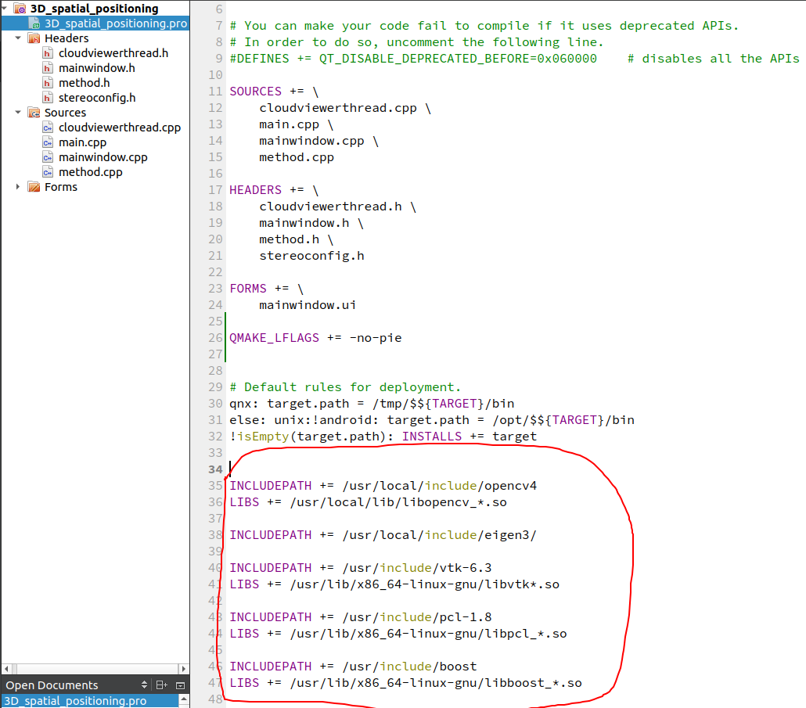

修改3D_spatial_positioning.pro文件下的路径

```
INCLUDEPATH += /usr/local/include/opencv4
LIBS += /usr/local/lib/libopencv_*.so

INCLUDEPATH += /usr/local/include/eigen3/

INCLUDEPATH += /usr/include/vtk-6.3
LIBS += /usr/lib/x86_64-linux-gnu/libvtk*.so

INCLUDEPATH += /usr/include/pcl-1.8
LIBS += /usr/lib/x86_64-linux-gnu/libpcl_*.so

INCLUDEPATH += /usr/include/boost
LIBS += /usr/lib/x86_64-linux-gnu/libboost_*.so
```

## 一、下载QT

### 1.参考链接

ubuntu18 Linux 系统安装QT5.12.12开发环境https://blog.csdn.net/yao51011010/article/details/129080491

【Qt】Ubuntu20.04中Qt5.12.12安装教程详解https://blog.csdn.net/dengjin20104042056/article/details/131705766


## 二、下载OpenCV

### 1.配置 cmake选项

```
sudo cmake -D CMAKE_BUILD_TYPE=RELEASE \
      -D CMAKE_INSTALL_PREFIX=/usr/local \
      -D OPENCV_EXTRA_MODULES_PATH=../opencv_contrib/modules \
      -D WITH_TBB=ON \
      -D WITH_V4L=ON \
      -D WITH_QT=ON \
      -D WITH_OPENGL=ON \
      -D OPENCV_GENERATE_PKGCONFIG=ON \
      -D WITH_CUDA=ON ..
```

### 2.编译安装

```
sudo make -j4

sudo make install
```

### 3.添加环境变量

    sudo /bin/bash -c 'echo "/usr/local/lib" > /etc/ld.so.conf.d/opencv.conf'
    或
    sudo gedit /etc/ld.so.conf.d/opencv.conf 
    //打开后可能是空文件，在文件内容最后添加
    /usr/local/lib
### 4.更新库

```bash
sudo ldconfig
```

### 5.配置BUSH

    sudo gedit /etc/bash.bashrc  
    //在末尾添加
    PKG_CONFIG_PATH=$PKG_CONFIG_PATH:/usr/local/lib/pkgconfig
    export PKG_CONFIG_PATH

### 6.最后执行

    sudo -s
    source /etc/bash.bashrc
    //**配置然后更新database
    sudo updatedb  
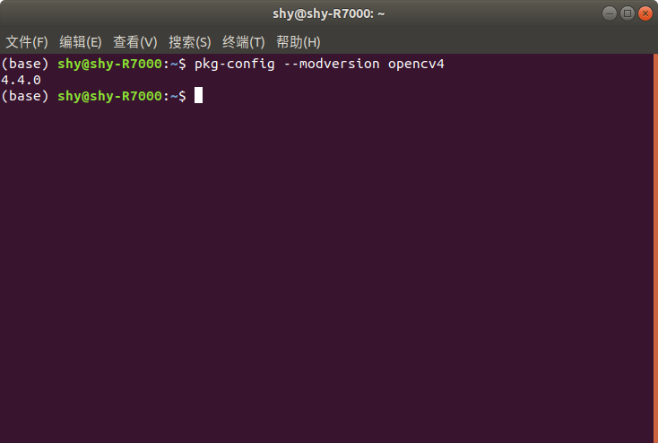

### 7.测试

进入opencv/samples/cpp/example_cmake目录下，终端打开，依次输入：

```bash
mkdir build
cd bulid
cmake ..
make
./opencv_example
```


### 8.QT中添加OpenCV配置

```
INCLUDEPATH += /usr/local/include/opencv4
LIBS += /usr/local/lib/libopencv_*.so
```

### 9.卸载opencv

```
sudo rm -rf /usr/local/include/opencv4 /usr/local/share/opencv4 /usr/local/bin/opencv* /usr/local/lib/libopencv*
```

###  10.查看版本信息

```bash
pkg-config --modversion opencv4
```

### 11.参考链接

Ubuntu20.04+opencv-4.3.0+opencv_contrib-4.3.0安装https://blog.csdn.net/qq_41203838/article/details/114154133

Ubuntu18.04+Qt+Opencv+opencv_contribhttps://blog.csdn.net/kangzhaofang/article/details/127647214

PCL+ VTK+QT ubuntu16.04配置 实现可视化点云https://blog.csdn.net/Curryfun/article/details/87991540


## 三、下载 VTK+PCL

### 1.下载链接

https://vtk.org/download/

https://gitcode.com/PointCloudLibrary/pcl/tags/pcl-1.8.0

### 2.参考链接

ubuntu20.04安装 VTK7.1与PCL1.8https://blog.csdn.net/qq_54199287/article/details/134136943

Ubuntu20.04安装VTKhttps://blog.csdn.net/m0_58235748/article/details/130528211

ubuntu16.04 安装Qt5 + VTK7.1.1 + PCL1.8.0https://blog.csdn.net/qq_34341423/article/details/112506398


# 问题

## 1.cmake安装OpenCV过程在要下载IPPICV会卡很久

找到opencv\sources\3rdparty\ippicv文件夹中的ippicv的cmake文件

找到42行中

```
https://raw.githubusercontent.com/opencv/opencv_3rdparty/${IPPICV_COMMIT}/ippicv/
```

加上

```
https://mirror.ghproxy.com/
```

变成

```
"https://mirror.ghproxy.com/https://raw.githubusercontent.com/opencv/opencv_3rdparty/${IPPICV_COMMIT}/ippicv/"
```


## 2.anaconda导致系统库的路径被覆盖

错误waring
runtime library [libssl.so.1.1] in /usr/lib/x86_64-linux-gnu may be hidden by files in:/home/
编译工程的过程中，因为安装了anaconda导致系统库的路径被覆盖掉，因而报错的时候

首先查看路径，可以看到返回结果中，第一个查找路径是anaconda的。

```
export $PATH
bash: export: `/home/rw/anaconda3/bin:/home/rw/anaconda3/condabin:/home/rw/.local/bin:/usr/local/sbin:/usr/local/bin:/usr/sbin:/usr/bin:/sbin:/bin:/usr/games:/usr/local/games:/snap/bin': not a valid identifier
```

先退出base环境

```
conda deactivate
```

改.bashrc文件:

```
sudo gedit ~/.bashrc
```


在末尾添加：覆盖原本的PATH

```
export PATH="/home/shy/anaconda3/condabin:/home/shy/.local/bin:/usr/local/sbin:/usr/local/bin:/usr/sbin:/usr/bin:/sbin:/bin:/usr/games:/usr/local/games:/snap/bin"
```

然后重启，或者
source ~/.bashrc


# 程序运行

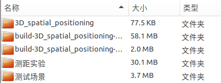

## 打开项目

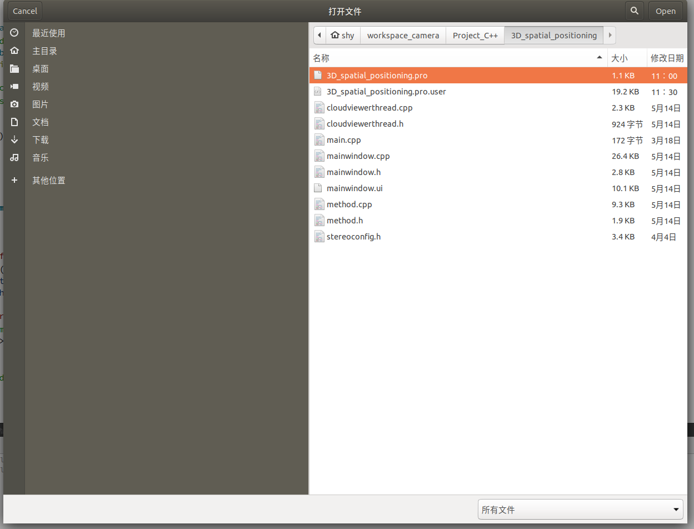

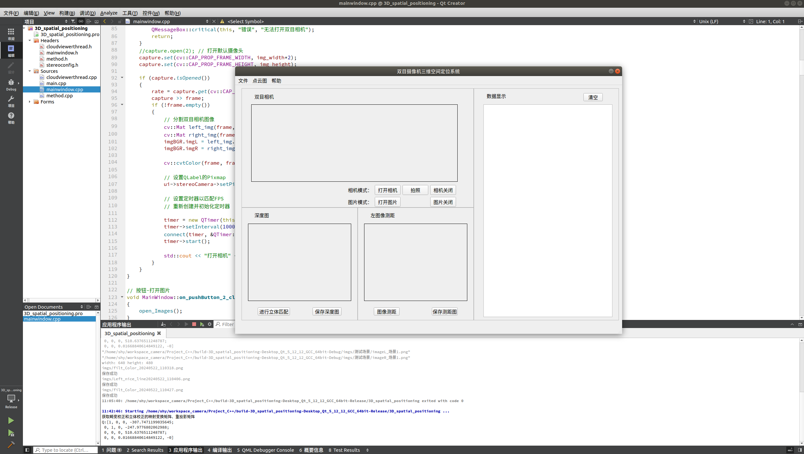

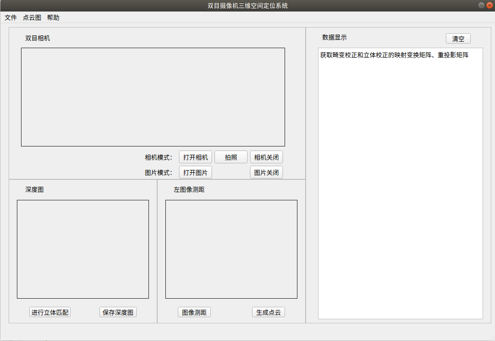

## 点击打开相机

默认相机为2

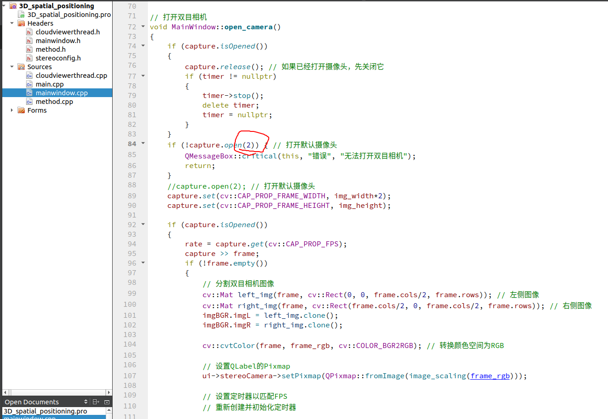

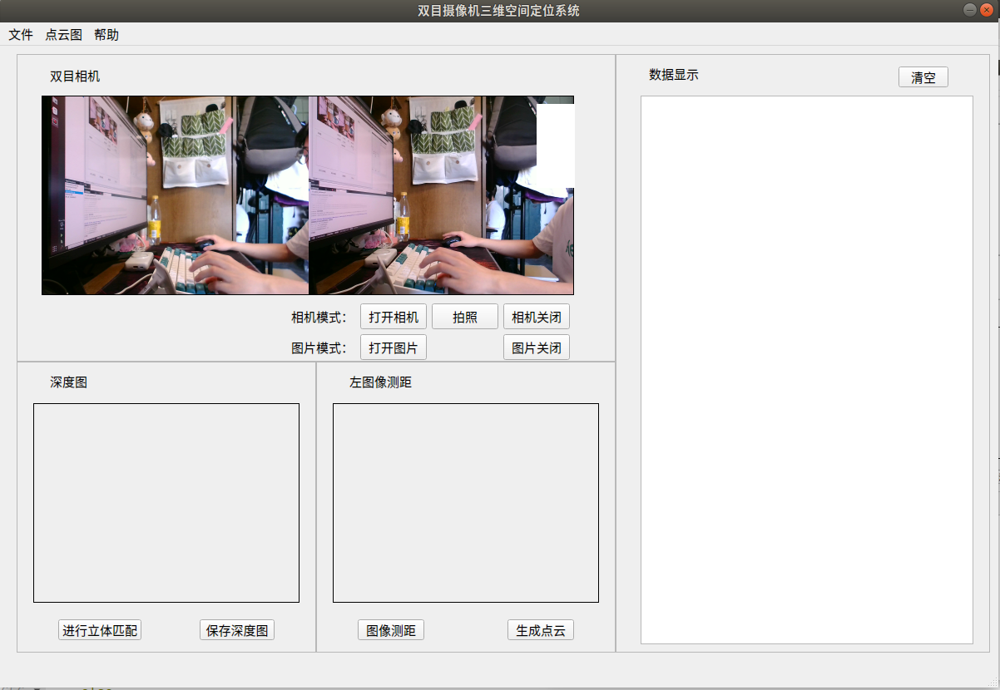

## 点击立体匹配

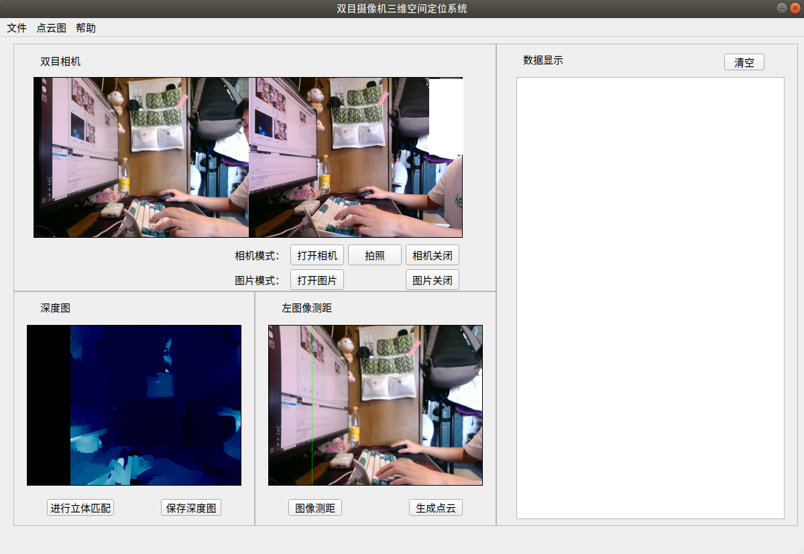

## 点击测距

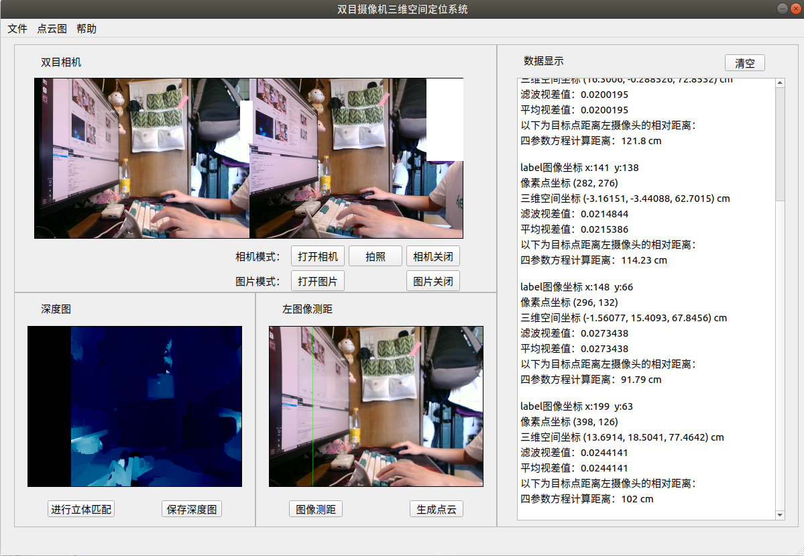

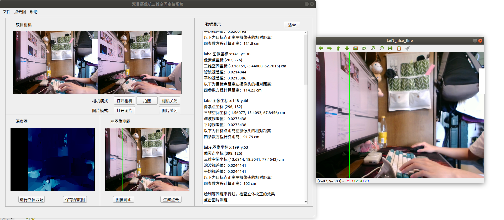

## 生成点云图

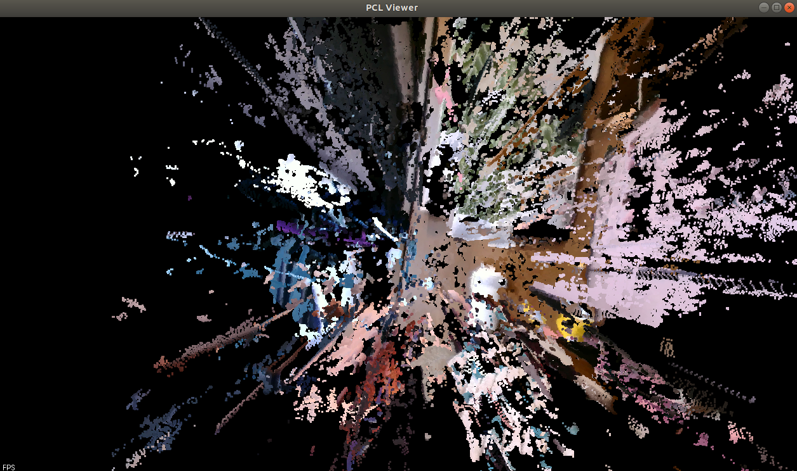
